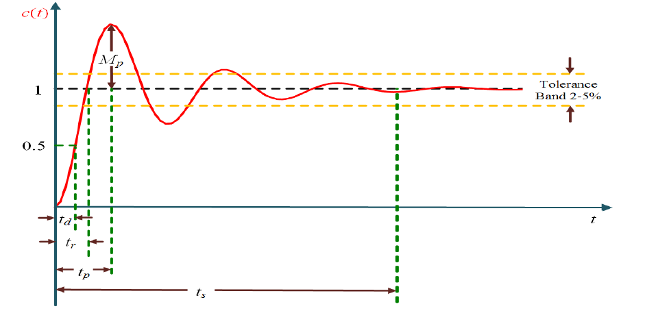

# Time Domain Analysis Using MATLAB

This project implements time domain analysis of **First Order** and **Second Order** systems using MATLAB.

---

## 📁 Files Included

- `experiment2.m` – MATLAB script that:
  - Defines 5 given transfer functions
  - Computes closed-loop systems with unity feedback
  - Plots step responses
  - Calculates and displays time-domain parameters:
    - Delay Time
    - Rise Time
    - Peak Time
    - Settling Time
    - Maximum Peak Overshoot
    - Steady-State Error

---

## 🧪 Transfer Functions Analyzed

| TF Number | Transfer Function |
|-----------|-------------------|
| TF1       | 100 / (10s)       |
| TF2       | 25 / (s² + 25s)   |
| TF3       | 25 / (s² + 5s)    |
| TF4       | 25 / (s² + 10s)   |
| TF5       | 25 / s²           |

---

## 📷 Screenshots

---

## ▶️ How to Run

1. Open MATLAB.
2. Place `experiment2.m` in your working directory.
3. Run the script.
4. View the step response plots and time domain parameters in the Command Window.

---

## 📌 Notes

- The `stepinfo` command extracts standard time-domain parameters.
- For steady-state error, the script uses DC gain for unit step input.
- Additional blocks for Simulink simulation include:
  - **Step**, **Transfer Function**, **Scope**, **Clock**

---

